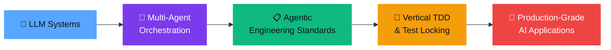

<!-- Header Banner -->
<div align="center">

<!-- Typing SVG -->
<a href="https://git.io/typing-svg"></a>

# Hey, I'm Afzal Mukhtar 👋

**`AI/ML Engineer` `Agentic Systems Architect` `LLM Infrastructure Builder`**

*Designing the operating systems that AI coding agents run on.*

[](https://www.linkedin.com/in/afzal-mukhtar)
[](https://github.com/afzalmukhtar)
[](#)

</div>

---

<div align="center">


</div>

---

## 🧬 About Me

```python
class AfzalMukhtar:
    """AI/ML Engineer building the infrastructure layer for intelligent agents."""

    role      = "AI/ML Engineer"
    company   = "Cisco"
    location  = "India 🇮🇳"
    education = "B.Tech, Computer Science"

    focus_areas = [
        "Multi-Agent Orchestration & Architecture",
        "LLM Evaluation, Judging & Debate Systems",
        "Retrieval-Augmented Generation (RAG)",
        "Agentic Engineering Standards & Workflows",
        "Model Context Protocol (MCP) Servers",
        "Contrastive Learning & Embedding Fine-Tuning",
    ]

    current_mission = (
        "Building rigorous, test-driven operating systems "
        "for AI coding agents — so they ship clean code, not slop."
    )
```

---

## 🏗️ Flagship Projects

<table>
<tr>
<td width="50%" valign="top">

### 🔮 [Agentic Engineering Standards](https://github.com/afzalmukhtar/agentic-engineering-standards)
> **The Operating System for AI Coding Agents**

A complete skill bundle that routes AI agent work through a rigorous lifecycle:

```
Context → Specification → Kanban → Vertical TDD → Review
```

- 🧪 **Vertical TDD** with SHA-256 test-lock immutability
- 📋 **Kanban delivery** with parallel wave execution
- 🔒 **Test-Lock Policy** — approved tests are immutable
- 🏛️ **18 composable skills** for every engineering stage
- 🤖 Works with Claude, Cursor, Codex, Windsurf & Antigravity

</td>
<td width="50%" valign="top">

### ⚖️ [LLM Tribunal](https://github.com/afzalmukhtar/llm-tribunal)
> **Multi-LLM Anonymous Review Panel**

A courtroom-style evaluation engine where multiple LLMs serve as anonymous judges with expert personas:

- 👥 **Expert Personas** — each judge has a distinct evaluation lens
- 🔀 **Cross-Examination** — judges challenge each other's reasoning
- 📊 **Scored Verdicts** — quantified consensus with dissent tracking
- 🎭 **Anonymous** — prevents model bias in deliberation

</td>
</tr>

<tr>
<td width="50%" valign="top">

### 🧑‍⚖️ [LLM-as-a-Judge](https://github.com/afzalmukhtar/llm-as-a-judge)
> **46 LLM Evaluation Techniques**

A comprehensive 2-hour build-along bootcamp covering the entire spectrum of LLM evaluation:

- 📐 **Pointwise, Pairwise & Listwise** scoring
- 🔄 **Multi-turn & Reference-free** evaluation
- 🧮 **Rubric-based & Chain-of-Thought** judging
- 🏭 **Production-ready** evaluation pipelines

</td>
<td width="50%" valign="top">

### 🃏 [Swipe Smart MCP](https://github.com/afzalmukhtar/swipe-smart-mcp) ⭐ 4
> **Model Context Protocol Server**

An MCP server that extends AI assistants with real-world tool capabilities:

- 🔌 **MCP Protocol** — native integration with Claude, Cursor & IDEs
- 🛠️ **Tool Orchestration** — structured tool calling and response handling
- ⚡ **Production-grade** error handling and retry logic

</td>
</tr>

<tr>
<td width="50%" valign="top">

### ⛏️ [Contrastive Miner](https://github.com/afzalmukhtar/contrasive-miner)
> **Hard Negative Mining for Embeddings**

Two-stage hard negative mining pipeline for contrastive learning with embedding models:

- 🎯 **Stage 1** — BM25 candidate retrieval
- 🧲 **Stage 2** — Embedding-space hard negative selection
- 📈 **Measurable lift** in retrieval precision
- 🔬 **Research-grade** implementation

</td>
<td width="50%" valign="top">

### 🧬 [RAG from Scratch](https://github.com/afzalmukhtar/rag-from-scratch)
> **First-Principles RAG Implementation**

Building Retrieval-Augmented Generation from the ground up:

- 📄 **Document Processing** — chunking, cleaning, embedding
- 🔍 **Retrieval** — vector search, re-ranking, hybrid
- 🧠 **Generation** — context-aware LLM prompting
- 📊 **Evaluation** — retrieval and generation quality metrics

</td>
</tr>
</table>

---

## 🛠️ AI Agent Skills & Tools

<table>
<tr>
<td width="33%" align="center">

### 🏛️ [Agent Architecture](https://github.com/afzalmukhtar/agent-architecture-skill)
Deep-module agent design patterns, state machines & tool orchestration

</td>
<td width="33%" align="center">

### 📏 [AI Engineering Standards](https://github.com/afzalmukhtar/ai-engineering-standards-skill)
Pydantic contracts, async concurrency, LLM prompts & coding discipline

</td>
<td width="33%" align="center">

### 🎯 [System Design Prep](https://github.com/afzalmukhtar/system-design-interview-prep-skill)
Level-aware HLD/LLD interview skill with DevTools screenshot integration

</td>
</tr>
<tr>
<td width="33%" align="center">

### 📋 [JIRA Integration](https://github.com/afzalmukhtar/jira-integration-skill)
AI agent skill for autonomous JIRA project management

</td>
<td width="33%" align="center">

### 🏆 [Achievement Tracker](https://github.com/afzalmukhtar/achievement-tracker-skill)
Track work contributions & generate manager-ready brag documents

</td>
<td width="33%" align="center">

### 🧮 [MCTS Prompt Tuner](https://github.com/afzalmukhtar/MTCS_PromptTuner)
Monte Carlo Tree Search for automated prompt optimization

</td>
</tr>
</table>

---

## ⚡ Tech Arsenal

<div align="center">

#### 🤖 AI / ML / LLM


#### 🛠️ Infrastructure & Tools


#### 🤖 Agent Platforms


</div>

---

## 🎯 What I'm Building

<div align="center">



</div>

| Area | What I'm Doing |
| :--- | :--- |
| 🏗️ **Agentic Standards** | Building the lifecycle that AI coding agents follow — Context → Spec → Kanban → Vertical TDD → Review |
| ⚖️ **LLM Evaluation** | Multi-judge panels, cross-examination, and consensus-driven evaluation systems |
| 🔍 **RAG & Retrieval** | Hard negative mining, domain-specific embedding fine-tuning, and graph-enhanced retrieval |
| 🔌 **MCP & Tool Use** | Model Context Protocol servers that give AI agents real-world capabilities |
| 🧠 **Agent Architecture** | Deep-module design patterns for stateful, tool-using, self-correcting agents |

---

## 📊 Languages & Activity

<div align="center">


</div>

---

## 🧭 Engineering Philosophy

<div align="center">

> *"Each Kanban card is a vertical slice — complete end-to-end behavior, not one layer.*
> *Write the acceptance test and confirm intentional RED before production code.*
> *After RED, the test is locked. Any change needs explicit approval, a fresh RED, and a new lock.*
> ***Tests are the proof** — scripts and harnesses do not substitute for them."*

</div>

<div align="center">

```
┌─────────────────────────────────────────────────────────┐
│                                                         │
│   "I don't build AI agents that write sloppy code.      │
│    I build the standards that prevent it."               │
│                                                         │
└─────────────────────────────────────────────────────────┘
```

</div>

---

<div align="center">

### 🤝 Let's Connect

*I'm always interested in conversations about agentic systems, LLM evaluation,*
*and building engineering rigor into AI-assisted development.*

[](https://www.linkedin.com/in/afzal-mukhtar)
[](https://github.com/afzalmukhtar)

<br/>


</div>
